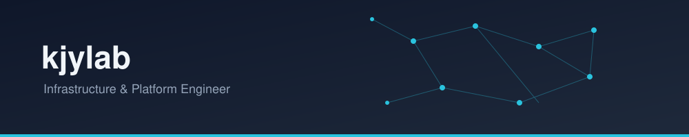

Terraform·Ansible로 인프라를 코드로 정의하고, Kubernetes 기반 플랫폼을 GitOps로 운영합니다.
많은 사람이 블랙박스로 여기는 계층을 직접 이해하는 걸 좋아합니다.

---

### Stack

**Provisioning**

**Platform**

**Data**
-4169E1?style=flat-square&logo=postgresql&logoColor=white)
-231F20?style=flat-square&logo=apachekafka&logoColor=white)

**Observability**

---

### Projects

<table>
<tr>
<td width="100%">

**kjylab MSA Platform**
Terraform + Ansible로 베어 EC2부터 프로비저닝한 셀프호스팅 Kubernetes 플랫폼. Istio(mTLS, 트래픽 관리) 기반 마이크로서비스 스택을 ArgoCD로 배포하고, CNPG PostgreSQL(Database-per-Service)과 Strimzi Kafka로 데이터 계층을 구성, Prometheus/Grafana/Loki/Tempo로 관측성을 확보했습니다.
`Terraform` `Ansible` `kubeadm` `Istio` `ArgoCD` `CNPG` `Strimzi`

</td>
</tr>
<tr>
<td>

**DropMong — 프로비저닝 파이프라인**
EC2 인스턴스가 하나도 없는 상태에서 실제 서비스 배포가 가능한 Kubernetes 클러스터가 되기까지의 전체 과정을 자동화한 파이프라인. Terraform이 인프라를 만들고 cloud-init을 거쳐 Ansible에 핸드오프, kubeadm으로 클러스터를 부트스트랩합니다. 여러 환경에서 재현 가능하도록 멱등성(Idempotency)을 보장합니다.
`Terraform` `Ansible` `cloud-init` `kubeadm`

</td>
</tr>
<tr>
<td>

**GO!비서 (AICD2)** — *과거 AI 프로젝트*
대화 속에서 시간·장소를 자동으로 추출해 최적의 약속 일정을 추천/확정해주는 텔레그램 기반 일정 조율 챗봇. 규칙 기반 키워드 추출과 GPT 기반 대화 요약을 결합해 별도 포맷 없이 자연스러운 대화만으로 일정을 조율합니다. 교통시스템공학·디지털미디어 전공 4인 팀 캡스톤 프로젝트.
`Python` `Telegram Bot` `Naver Map API` `GPT`

</td>
</tr>
</table>
